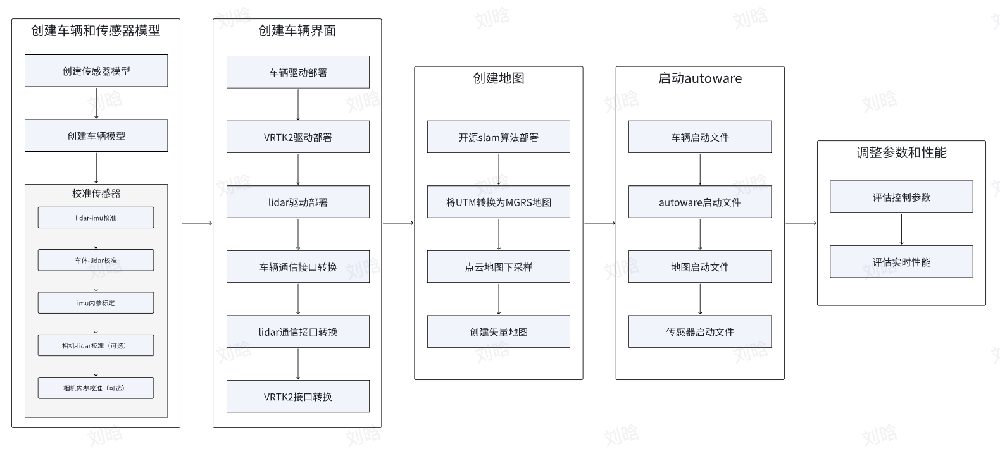

# Autoware Sensor Drivers for ROS2 Galactic

这个仓库包含了一系列为基于ROS2 Galactic部署Autoware准备的传感器驱动。支持的硬件包括RoboSense的RS16激光雷达，Fixposition的VRTK2，OAK的双目相机和Agilex的mini底盘。

## 内容

1. **Fixposition VRTK2驱动**：用于接收和处理Fixposition VRTK2的数据。使用方法请参考[这里](https://github.com/fixposition/fixposition_driver)。

2. **RoboSense RS16激光雷达驱动**：用于接收和处理RoboSense RS16激光雷达的数据。使用方法请参考[这里](https://github.com/RoboSense-LiDAR/rslidar_sdk)。

3. **RoboSense激光雷达转换包**：将RoboSense输出的Velodyne格式的激光雷达点云转换成去除NaN的形式，使得lio-sam建图不报错。

4. **odom_to_llh功能包**：将Fixposition的odom话题转换为llh话题，方便后续在SLAM中添加GPS信息做好基础。

## 安装

### 环境

ubuntu 20.04
ROS2 Galactic

### 安装步骤

1. 安装Fixposition VRTK2驱动和RoboSense RS16激光雷达驱动，请按照各个驱动的链接中的安装指南进行安装。

2. 安装RoboSense激光雷达转换包和odom_to_llh功能包，执行以下命令：

\`\`\`bash
colcon build
source install/setup.bash
\`\`\`

## 使用

### LIDAR:

\`\`\`bash
python3 autoware_lidar_time.py
source install/setup.bash
ros2 launch rslidar_sdk start.py
# ros2 run lidar_adaption lidar_adaption //no use
\`\`\`

### CAMERA:

\`\`\`bash
source install/setup.bash
ros2 launch depthai_examples mobile_publisher.launch.py camera_model:=OAK-D-LITE
ros2 launch depthai_examples rgb_publisher.launch.py camera_model:=OAK-D-LITE
\`\`\`

### VRTK2:

在串行模式下启动节点，运行：

\`\`\`bash
ros2 launch fixposition_driver_ros2 serial.launch
\`\`\`

在TCP模式（Wi-Fi）下：

\`\`\`bash
ros2 launch fixposition_driver_ros2 tcp.launch
\`\`\`

在TCP模式（以太网）下：

\`\`\`bash
ros2 launch fixposition_driver_ros2 tcp.launch
\`\`\`

### Building:

\`\`\`bash
colcon build --packages-skip fixposition_driver_ros1 fixposition_odometry_converter_ros1
\`\`\`

### VRTK2 odom topic to llh

\`\`\`bash
source install/setup.bash 
ros2 run odm_to_llh odm_to_llh 
\`\`\`

### git:

\`\`\`bash
cd src 
git add .
git commit -m " "
git push origin main
\`\`\`

### topic:

| sensor | topic | frame_id |
| --- | --- | --- |
| lidar | /points | lidar_link |
| imu | /fixposition/corr_imu | imu_link |
| gps | /sensing/gnss/ublox/nav_sat_fix | gnss_link |
| camera | /color/image | camera4/camera_link |

### 如何配置你自己的传感器

#### VRTK2:

1. 将fixposition_driver_ros2/src/data_to_ros2.cpp中的33行与50行直接改为固定frame_id
2. 将fixposition_driver_ros2/src/fixpostion_driver_node.cpp中的45行与46行设置为对应的rostopic

#### camera:

deptahi_examples/ros2_src/rgb_publisher:49、52line

#### lidar:

rs_to_velodyne/src/rs_to_velodyne.cpp 97,231 line,configure your own topic and the frame id.

## 贡献

欢迎任何形式的贡献，包括但不限于问题报告，功能建议，代码提交等。

## 许可

请参考各个驱动的许可信息。
